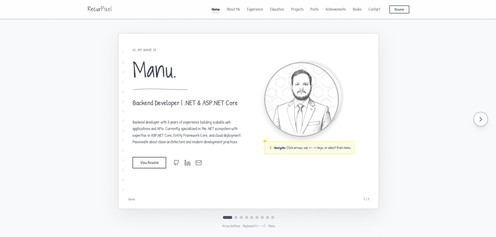

# 📖 RecurPixel Portfolio - Sketch Style

A unique, hand-drawn aesthetic portfolio website that mimics a physical sketchbook with page-flipping interactions.



## ✨ Features

- 🎨 **Sketch-style design** - Pencil-drawn aesthetic with hand-drawn fonts
- 📖 **Page-flip navigation** - Book-like experience with smooth transitions
- 📱 **Fully responsive** - Works beautifully on all devices
- ⌨️ **Multiple navigation options** - Arrows, keyboard shortcuts, menu, dots
- 🎯 **Modular content** - Easy to update via data files
- 🔧 **Configurable sections** - Show/hide any section with simple toggles
- 🚀 **Fast & lightweight** - Built with React and Vite
- 📊 **Dev.to integration** - Automatically displays your latest blog posts

## 🎯 Sections

1. **Home** - Hero introduction with profile picture
2. **About** - Skills overview and career transition story
3. **Experience** - Work history with timeline
4. **Education** - Academic background and technical skills
5. **Projects** - Portfolio projects showcase
6. **Posts** - Latest Dev.to blog articles
7. **Achievements** - Certifications and milestones
8. **Books** - Books you're writing (with progress tracking)
9. **Contact** - Social links and contact information

## 🚀 Quick Start

### Prerequisites
- Node.js 16+ and npm
- Git

### Installation

```bash
# Clone the repository
git clone https://github.com/RecurPixel/recurpixel.github.io.git
cd portfolio

# Install dependencies
npm install

# Start development server
npm run dev

# Open http://localhost:5173
```

### Build for Production

```bash
# Create optimized build
npm run build

# Preview production build
npm run preview
```

## 📝 Customization

### Update Your Content

Edit `src/portfolioData.js` with your information:

```javascript
const portfolioData = {
  personal: {
    name: 'Your Name',
    tagline: 'Your Tagline',
    bio: 'Your bio...'
  },
  // ... update all sections
}
```

### Show/Hide Sections

Edit `src/portfolioConfig.js`:

```javascript
const portfolioConfig = {
  pages: {
    books: {
      enabled: false // Hide Books section
    },
    // ... toggle any section
  }
}
```

### Add Your Images

Replace placeholder images in `/public/assets/`:
- `profile-passport.png` - Main profile photo
- `profile-standing-side.png` - About page photo
- `resume.pdf` - Your resume
- `favicon.ico` - Browser icon
- `og-image.png` - Social media preview

### Update Social Links

In `portfolioConfig.js`:

```javascript
social: {
  github: 'https://github.com/YourUsername',
  linkedin: 'https://linkedin.com/in/YourProfile',
  email: 'your@email.com',
  devto: 'https://dev.to/yourusername'
}
```

## 🎨 Navigation Controls

- **Arrow Buttons** - Click left/right arrows to flip pages
- **Keyboard** - Use ← → arrow keys
- **Menu** - Click any section in header menu
- **Page Dots** - Click dots below the page
- **Mobile** - Swipe or tap arrow buttons

## 📦 Project Structure

```
portfolio/
├── public/
│   └── assets/          # Images, resume, favicon
├── src/
│   ├── App.jsx          # Main component
│   ├── portfolioData.js # Content data
│   └── portfolioConfig.js # Show/hide toggles
├── package.json
├── vite.config.js
└── README.md
```

## 🚀 Deployment

### Deploy to GitHub Pages

```bash
# Build and deploy
npm run deploy
```

### Configure GitHub Pages
1. Go to repository Settings → Pages
2. Source: `gh-pages` branch
3. Save and wait 2-3 minutes
4. Visit `https://your-username.github.io/`

See [PUBLISHING_GUIDE.md](./PUBLISHING_GUIDE.md) for detailed deployment instructions.

## 🛠️ Built With

- [React](https://react.dev/) - UI library
- [Vite](https://vitejs.dev/) - Build tool
- [Lucide React](https://lucide.dev/) - Icon library
- [Tailwind CSS](https://tailwindcss.com/) - Styling (via CDN)
- [Google Fonts](https://fonts.google.com/) - Hand-drawn typography

## 📱 Browser Support

- Chrome/Edge (latest)
- Firefox (latest)
- Safari (latest)
- Mobile browsers (iOS Safari, Chrome Mobile)

## 🤝 Contributing

This is a personal portfolio template. Feel free to fork and customize for your own use!

## 📄 License

MIT License - feel free to use this template for your own portfolio.

## 📧 Contact

- **GitHub**: [@RecurPixel](https://github.com/RecurPixel)
- **LinkedIn**: [RecurPixel](https://linkedin.com/in/RecurPixel)
- **Email**: recurpixel@gmail.com
- **Dev.to**: [@recurpixel](https://dev.to/recurpixel)

## 🙏 Acknowledgments

- Inspired by physical sketchbook aesthetics
- Hand-drawn fonts from Google Fonts
- Icons from Lucide React

---

Made with ❤️ by RecurPixel